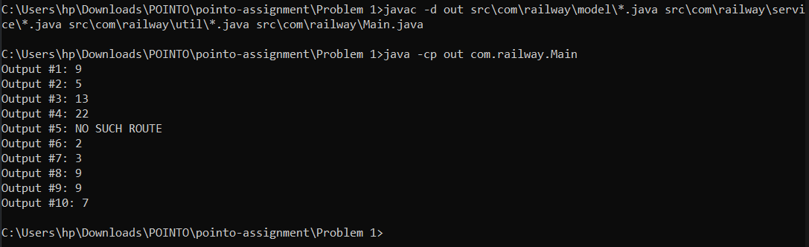

<h1 align="center">🚆 Indian Railway Route Analyzer</h1>

## 📋 Problem Statement

The local commuter railroad operates between several cities in India, with each route being
one-way due to budget constraints. This means that a route from Delhi to Chennai does not
automatically imply a return route from Chennai to Delhi. In fact, even if both routes do exist, they
could be distinct and have different distances.

The goal of this problem is to assist the railroad in providing valuable route information to its
customers. Specifically, you will need to calculate the following:

- 🔢 The total distance along a specific route.
- 🔁 The number of different routes available between two cities.
- 🧭 The shortest possible route between two cities.

---

## 🧑‍💻 How It Works

### 🗂 Input
- Comes from a text file `input.txt`.
- Example content:
  AB5, BC4, CD8, DC8, DE6, AD5, CE2, EB3, AE7

### Evidence

<p align="center">
  
</p>

## 🚀 How to Run

1. **Compile the code**
   ```bash
   g++ .\program.cpp
   ```

2. **Run the executable file**
    ```bash
   .\a.exe
    ```